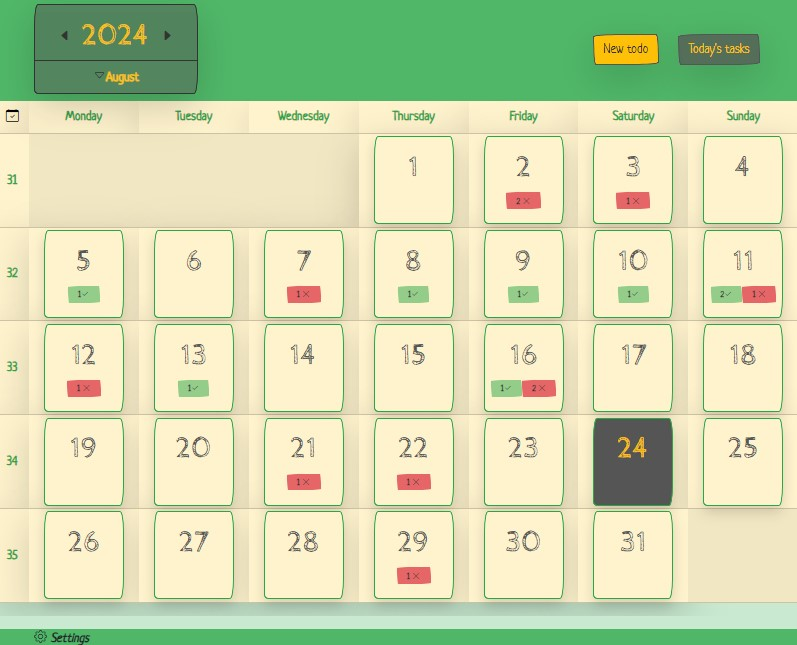
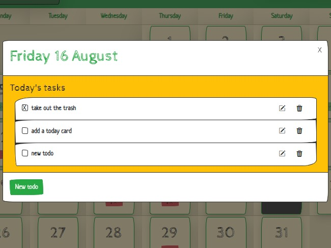
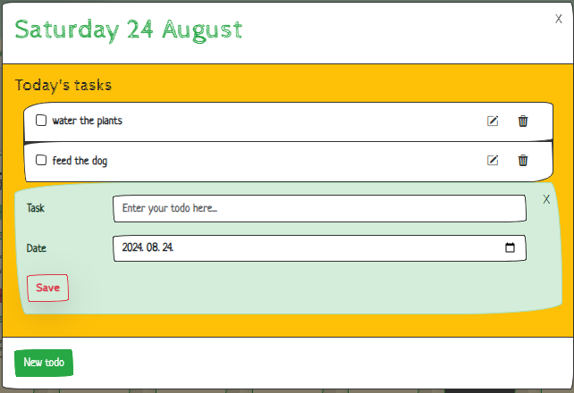

# Check Mate

## Table of Contents

- [About The Project](#about-the-project)
- [Technologies](#technologies)
- [Features](#features)
- [Installation](#installation)

## About The Project
Check Mate is a todo application designed to help you manage your tasks efficiently.
The app provides a calendar-like view of a selected month, allowing you to easily add new todos or check both finished and unfinished ones.

## Technologies

## Features
-`Monthly View`: Displays the current month with indicators for the number of completed and pending todos, while highlighting the current day. The page includes a year and a month selector, settings with customizable options, and quick access for adding new tasks and viewing daily todos.

-`Daily View`: Displays the selected day along with its associated todos. Tasks can be marked as finished or unfinished, updated or deleted. New todos can also be added.

<table>
  <tr>
    <td></td>
    <td></td>
  </tr>
</table>

## Installation
